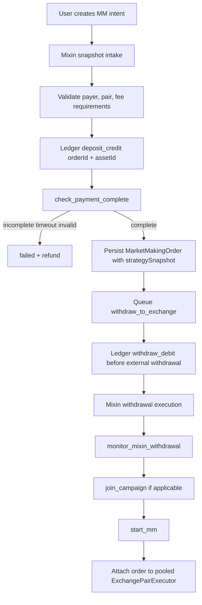
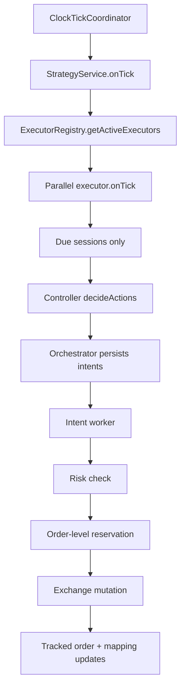
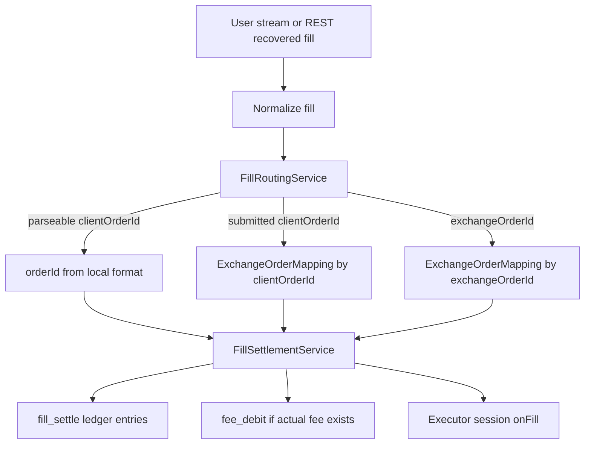

# Market Making Flow

This document describes the current backend market-making flow.

Source of truth is the yellowpaper architecture under `docs/`, with the
current implementation mainly under `server/src/modules/market-making/**`.

## Architecture Summary

Market making is split into three layers:

1. **Funding Layer**: deposits, withdrawals, rewards
2. **Scheduling Layer**: tick, strategy controllers, intent dispatch
3. **Trading Layer**: reservation, exchange orders, fills, reconciliation

Core invariants:

- Ledger is the balance source of truth.
- Market-making balances are scoped by `orderId + assetId`.
- All balance changes are immutable, idempotent ledger entries.
- Strategy controllers only produce actions/intents.
- Intent execution owns risk checks, reservation, exchange mutation, tracked
  orders, and state transitions.
- Tick must not perform exchange I/O, REST settlement, or direct balance
  mutation.
- External order placement requires risk check and order-level reservation
  first.
- Fills, fees, withdrawals, rewards, and reversals must be attributable to an
  order.
- Reconciliation pauses or blocks risk-increasing paths when mismatch evidence
  exists.

## Core Runtime

The active runtime is tick-driven, intent-driven, and uses pooled executors.

1. `ClockTickCoordinatorService` drives registered runtime components.
2. `StrategyService` ticks active `ExchangePairExecutor(exchange, pair)` pools
   in parallel.
3. Each executor evaluates due sessions only.
4. Strategy controllers read cached runtime state and emit actions.
5. `ExecutorOrchestratorService` persists actions as strategy intents.
6. Intent worker/execution service processes intents asynchronously.
7. Create-order intents run risk checks, reserve order funds, submit exchange
   orders, then track external order state.
8. Fills route back from private stream or REST recovery into settlement and
   runtime state.
9. Reconciliation validates ledger, tracked orders, fills, fees, rewards, and
   intent consistency.

## Main Modules

### Funding / User Order Lifecycle

- `market-making/user-orders/user-orders.service.ts`
- `market-making/user-orders/market-making.processor.ts`
- `market-making/user-orders/market-making-runtime.service.ts`
- `market-making/ledger/balance-ledger.service.ts`
- `market-making/ledger/order-reservation.service.ts`
- `mixin/snapshots`
- `mixin/withdrawal`

### Strategy / Scheduling

- `market-making/tick/clock-tick-coordinator.service.ts`
- `market-making/strategy/strategy.service.ts`
- `market-making/strategy/execution/executor-registry.ts`
- `market-making/strategy/execution/exchange-pair-executor.ts`
- `market-making/strategy/execution/strategy-runtime-dispatcher.service.ts`
- `market-making/strategy/intent/executor-orchestrator.service.ts`
- `market-making/strategy/data/strategy-market-data-provider.service.ts`
- `market-making/strategy/observation/*`

### Trading / Execution

- `market-making/strategy/execution/strategy-intent-worker.service.ts`
- `market-making/strategy/execution/strategy-intent-execution.service.ts`
- `market-making/strategy/execution/strategy-intent-store.service.ts`
- `market-making/execution/exchange-connector-adapter.service.ts`
- `market-making/execution/exchange-order-mapping.service.ts`
- `market-making/execution/fill-routing.service.ts`
- `market-making/strategy/settlement/fill-settlement.service.ts`
- `market-making/trackers/*`

### Reconciliation / Rewards

- `market-making/reconciliation/reconciliation.service.ts`
- `market-making/reconciliation/exchange-order-reconciliation-runner.ts`
- `market-making/rewards/*`
- `market-making/durability/durability.service.ts`

## User Funding Flow



### 0. Intent Creation

User creates a market-making intent through:

`POST /user-orders/market-making/intent`

The intent binds:

- `orderId`
- authenticated `userId`
- `marketMakingPairId`
- `strategyDefinitionId`
- optional `configOverrides`

The server validates strategy definition visibility, config schema, and
reserved/system-managed fields before accepting overrides.

### 1. Snapshot Intake

`process_market_making_snapshots`:

1. Validates the market-making pair.
2. Verifies snapshot payer matches the intent-bound user.
3. Computes required fee coverage.
4. Credits the deposit through `BalanceLedgerService.creditDeposit`.
5. Uses idempotency key `snapshot-credit:{snapshotId}`.
6. Updates `PaymentState`.
7. Queues `check_payment_complete`.

Ledger entry scope is `orderId + assetId`, not `userId + assetId`.

### 2. Payment Completion

`check_payment_complete`:

1. Checks base asset, quote asset, and fee coverage.
2. Fails and refunds incomplete/invalid orders after timeout or retry
   exhaustion.
3. Resolves and stores a pinned `strategySnapshot`.
4. Creates or updates `MarketMakingOrder`.
5. Sets order state to `payment_complete`.
6. Queues `withdraw_to_exchange`.

`strategySnapshot` is required for runtime start.

Example shape:

```typescript
strategySnapshot: {
  strategyDefinitionId: string;
  definitionKey: string;
  definitionName: string;
  controllerType: string;
  resolvedConfig: Record<string, unknown>;
  resolvedAt: string;
  configHash?: string;
}
```

### 3. Withdrawal To Exchange

`withdraw_to_exchange`:

1. Sets state to `withdrawing`.
2. Resolves exchange API key and deposit networks.
3. Fetches exchange deposit addresses.
4. Applies `withdraw_debit` ledger entries before external withdrawal.
5. Calls withdrawal service.
6. On failure after debit, compensates with `deposit_credit`.
7. Queues `monitor_mixin_withdrawal`.

This path is not documented as disabled or validation-only. If a deployment
intentionally disables external withdrawal, that must be represented as runtime
configuration or operational state, not as the default architecture.

### 4. Campaign Join

`join_campaign`:

1. Optionally joins a HuFi campaign when campaign details are provided.
2. Updates local order state.
3. Queues `start_mm`.

Campaign linkage may be asynchronous and may be detached from the direct order
lifecycle for admin-direct paths.

### 5. Start Runtime

`start_mm`:

1. Sets order state to `running`.
2. Requires `strategySnapshot.resolvedConfig`.
3. Converts `controllerType` to runtime `StrategyType`.
4. Calls `StrategyRuntimeDispatcher.startByStrategyType()`.
5. Attaches the order to `ExchangePairExecutor(exchange, pair)`.
6. Links strategy definition metadata to the runtime instance.

Runtime does not re-resolve strategy config from current admin definitions when
starting an order. The pinned snapshot is the source of truth.

## Admin Direct Flow

Admin-direct market making bypasses the user payment flow.

1. Admin creates a direct order.
2. Service resolves a pinned strategy snapshot.
3. Order is marked with `source=admin_direct`.
4. Runtime account identity is stored through API-key/account-label metadata.
5. Direct start reuses the same runtime start path as `start_mm`.
6. Status endpoints read executor state, tracker state, queue state, exchange
   balances, and strategy counters.

## Adaptive PMM Flow

Adaptive PMM keeps the same runtime boundary: the PMM strategy path only emits
intents, while workers still own reservation, exchange mutation, tracked order
state, settlement, and reconciliation.

The adaptive path adds three read-only decision inputs:

1. `OrderBookTrackerService` stores bounded mid-price history from accepted
   tracked books.
2. `StrategyMarketDataProviderService` exposes cache-only PMM signal snapshots:
   reference price, microprice, volatility, imbalance, freshness, and crash
   state.
3. Runtime observation services expose fill markout toxicity and recent reject
   or rate-limit pressure.

On each PMM tick, `StrategyService` reads those inputs and builds effective
spread, size, layer, cadence, and side-pause parameters for
`QuoteExecutorManagerService`. The quote manager still returns quote candidates;
the orchestrator persists create/cancel intents; the intent worker still applies
risk gates, order-level reservations, exchange calls, tracked-order updates, and
reservation release.

Safety gates stay ahead of adaptive quoting:

- missing or stale tracked market data, crash signals, connector health issues,
  or reservation pause block new creates;
- unsafe PMM ticks may emit cancel intents for existing live orders;
- warmup uses conservative one-layer quotes with wider spread and smaller size
  until signal history is sufficient;
- order-scoped ledger balances are the preferred inventory source.

See `docs/architecture/strategies/adaptive-pmm.md` for formulas, priorities,
and module ownership.

Admin-direct orders must remain isolated from user-facing order queries while
sharing the production runtime.

## Tick And Intent Flow



Important rules:

- Controllers must not place exchange orders.
- Controllers must not mutate balances.
- Tick should read cached order book, tracked order, balance, and stream-health
  state.
- REST balance refresh and REST order reconciliation run outside the shared tick
  loop.
- Intent execution runs through the intent worker. The tick path persists
  intents only and must not synchronously execute exchange mutations.

## Order Reservation

Create-limit-order execution:

1. Validates exchange, pair, side, quantity, price.
2. Validates market-making order state.
3. Validates market-data freshness.
4. Validates API key health and permissions.
5. Reserves funds through `OrderReservationService.reserveForLimitOrder`.
6. Submits the exchange order.
7. Reserves/releases client-order mapping.
8. On failed create before external acknowledgement, releases reservation.
9. On cancel/reject/expire terminal states, releases remaining unfilled
   reservation.
10. On startup, exchange open-order reconciliation must complete before a
    strategy session is activated. If the exchange state cannot be read, the
    strategy is blocked from ticking.
11. Interrupted create intents stuck in `SENT` / `ACKED` are recovered
    one-by-one: owned open exchange orders are restored into `tracked_order`
    with slot/price/quantity metadata and keep their reservation; intents with
    no owned live order release their reservation idempotently.
12. Interrupted cancel intents stuck in `SENT` / `ACKED` are retried or
    reconciled against exchange order state before startup completes.

Reservation is expressed through ledger entries:

- `reserve_lock`
- `reserve_release`

## User Stream And Recovery

Private stream handling is normalized before it reaches strategy runtime:

- `UserStreamIngestionService` reads exchange private events.
- Exchange-specific normalizers convert order/trade/balance events into the
  internal user-stream event contract.
- `UserStreamTrackerService` updates tracked order and balance state.
- REST recovery paths can re-enter the same routing/settlement boundary when
  private stream evidence is missing or delayed.

Current operating modes:

- **Full stream**: order, trade, and balance events are available.
- **Partial stream**: missing event families are filled by REST refresh or
  reconciliation.
- **REST-only**: private stream is unavailable, so tracked-order polling and
  reconciliation provide recovery evidence.

Stream-health and balance-cache state are runtime inputs. Strategy ticks should
skip risk-increasing decisions when required cached state is stale rather than
fetching exchange state inline.

## Fill Routing And Settlement



Fill routing priority:

1. Parse local `{orderId}:{seq}` format when present.
2. Fall back to `ExchangeOrderMapping` by submitted `clientOrderId`.
3. Fall back to `ExchangeOrderMapping` by `exchangeOrderId`.
4. If unresolved, emit manual-review evidence and do not mutate ambiguous
   balances.

Fill settlement:

- Settles base/quote movement through order-scoped ledger entries.
- Applies actual fee debit when fee data is available.
- Uses stable fill identity for idempotency.
- Does not rely on local receipt time as the only idempotency input.
- Tracks per-exchange-order `settledFilledQty` on `tracked_order`. Runtime
  fill handling compares incoming cumulative fill progress with this settled
  progress and submits only the positive delta to ledger settlement.
- Terminal order handling releases only the unfilled reservation remainder
  (`order qty - cumulative filled qty`), so partial fills consume locked funds
  and cancelled/filled endings return only what remains.
- Replayed, stale, or lower cumulative fill events do not mutate balances. A
  ledger settlement failure pauses reservation for the affected `orderId +
  asset` until reconciliation clears it, and must not be treated as a generic
  balance adjustment path.

## clientOrderId Formats

The helper supports two related IDs:

```typescript
buildClientOrderId(orderId, seq)
// returns: `${orderId}:${seq}`
// local parseable format, useful for routing assertions

buildSubmittedClientOrderId(orderId, seq)
// returns: sha1(`${orderId}:${seq}:submitted`).slice(0, 20)
// exchange-safe submitted format

parseClientOrderId(clientOrderId)
// parses only local `${orderId}:${seq}` format
```

The submitted live exchange ID is resolved back to an order through
`ExchangeOrderMapping`.

Prerequisites:

- local parseable format requires a non-empty `orderId` with no `:` and a
  non-negative integer `seq`
- submitted format requires a non-empty `orderId` and a non-negative integer
  `seq`

## Ledger Rules

All balance mutations go through `BalanceLedgerService`.

Common ledger entry types:

- `deposit_credit`
- `withdraw_debit`
- `reserve_lock`
- `reserve_release`
- `fill_settle`
- `fee_debit`
- `reward_credit`
- `reversal`

Rules:

- Balance read model is `MarketMakingOrderBalance(orderId, assetId)`.
- Ledger entries are append-only.
- Mutations are idempotent by key and reject same-key/different-payload replays.
- Mutation locking is scoped by `orderId + assetId`.
- Rebuild can compare read model against ledger facts.
- Reservation can be paused when reconciliation finds mismatches.

## Reconciliation

Reconciliation covers:

- ledger balance invariants
- intent lifecycle consistency
- tracked order consistency
- estimated fee aging/correction
- fill attribution
- private-trade-backed fill evidence
- reward allocation consistency

On mismatch, reconciliation must not create generic balance adjustments. It
should emit evidence, pause affected reservation paths where needed, and use
typed correction/reversal facts.

## Queue Jobs

Queue: `market-making`

- `process_market_making_snapshots`
- `check_payment_complete`
- `withdraw_to_exchange`
- `monitor_mixin_withdrawal`
- `join_campaign`
- `start_mm`
- `stop_mm`

Removed from runtime flow:

- `execute_mm_cycle`

## Common States

User funding path:

`payment_pending -> payment_complete -> withdrawing -> joining_campaign -> created -> running -> stopped`

Failure path:

`failed`

Admin-direct path may skip funding states and enter runtime through the direct
start flow.

## Operational Notes

- `strategy.execute_intents=false` persists/skips intents without exchange
  mutation.
- The intent worker decouples tick from exchange I/O.
- Orders require `strategySnapshot` before runtime start.
- `dualAccountVolume` uses maker/taker account labels under the same pooled
  `exchange:pair` executor.
- REST order reconciliation and balance refresh run outside the shared tick
  loop.
- Reconciliation mismatches should block risk-increasing operations instead of
  being papered over.

## File Structure

```text
server/src/modules/market-making/
├── balance-state/
│   ├── balance-refresh-scheduler.ts
│   ├── balance-state-cache.service.ts
│   └── balance-state-refresh.service.ts
├── durability/
│   └── durability.service.ts
├── execution/
│   ├── exchange-connector-adapter.service.ts
│   ├── exchange-order-mapping.service.ts
│   └── fill-routing.service.ts
├── ledger/
│   ├── balance-ledger.service.ts
│   └── order-reservation.service.ts
├── reconciliation/
│   ├── exchange-order-reconciliation-runner.ts
│   └── reconciliation.service.ts
├── rewards/
├── strategy/
│   ├── controllers/
│   │   ├── arbitrage-strategy.controller.ts
│   │   ├── dual-account-best-capacity-volume-strategy.controller.ts
│   │   ├── dual-account-volume-strategy.controller.ts
│   │   ├── pure-market-making-strategy.controller.ts
│   │   ├── time-indicator-strategy.controller.ts
│   │   └── volume-strategy.controller.ts
│   ├── data/
│   │   └── strategy-market-data-provider.service.ts
│   ├── dex/
│   │   └── strategy-config-resolver.service.ts
│   ├── execution/
│   │   ├── exchange-pair-executor.ts
│   │   ├── executor-registry.ts
│   │   ├── strategy-intent-execution.service.ts
│   │   ├── strategy-intent-store.service.ts
│   │   ├── strategy-intent-worker.service.ts
│   │   └── strategy-runtime-dispatcher.service.ts
│   ├── intent/
│   │   ├── executor-orchestrator.service.ts
│   │   └── quote-executor-manager.service.ts
│   ├── settlement/
│   │   └── fill-settlement.service.ts
│   └── strategy.service.ts
├── tick/
│   ├── clock-tick-coordinator.service.ts
│   └── runtime-timing.service.ts
├── trackers/
│   ├── exchange-order-tracker.service.ts
│   ├── order-book-ingestion.service.ts
│   ├── order-book-tracker.service.ts
│   ├── user-stream-ingestion.service.ts
│   └── user-stream-tracker.service.ts
└── user-orders/
    ├── market-making.processor.ts
    ├── market-making-runtime.service.ts
    └── user-orders.service.ts
```

## Last Updated

- Date: 2026-05-21
- Status: Active
- Architecture: Yellowpaper-aligned market-making runtime
