# Server Architecture Diagrams

Mermaid diagrams of the `server/` architecture, drawn from the yellowpaper
(`docs/product/yellowpaper.md`), whitepaper (`docs/product/whitepaper.md`),
the module map (`module-map.md`), and business flows (`business-flows.md`).

The yellowpaper is the source of truth. Where code and paper diverge, the paper wins.

---

## 1. Three-Layer Architecture (Yellowpaper §1)

The system is three vertical layers plus horizontal capabilities that cut across all of them.

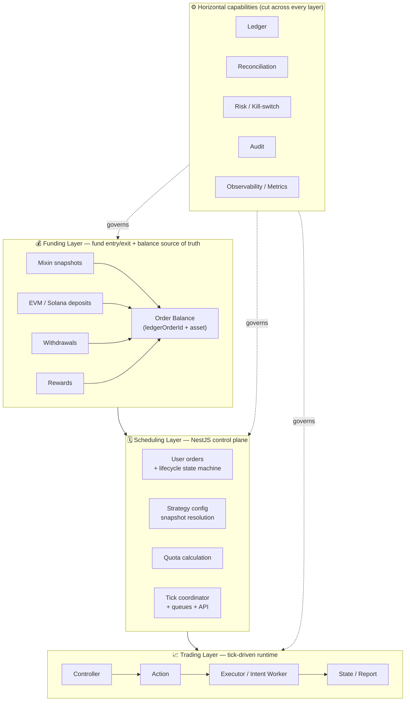

### Core data flow (Yellowpaper §1)

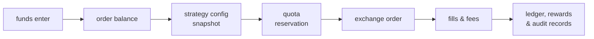

---

## 2. Trading / Execution Layer Flow (Yellowpaper §4.4)

The execution layer separates *decision* (Controller) from *side effects* (Worker / Execution).
Tick only advances time; it must never block on exchange I/O, REST, or DB settlement.

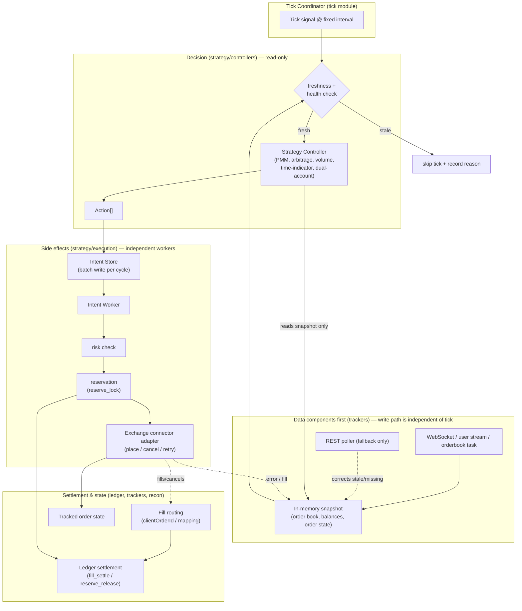

### Parallelism boundaries (Yellowpaper §4.4.4)

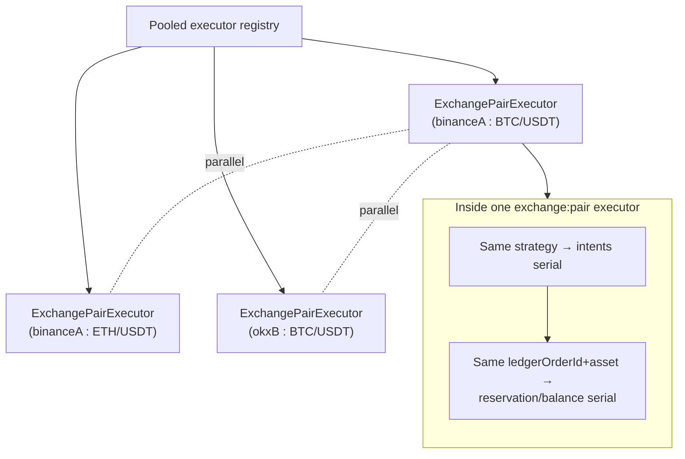

---

## 3. Module Dependency Map (server/src/modules)

Domain-grouped view of how NestJS modules compose. `AppModule` is the only place
all domains are wired together.

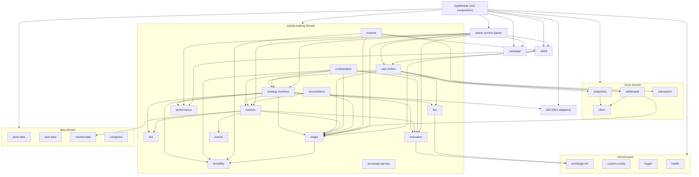

---

## 4. State Machines (Yellowpaper §3.5, §3.8)

### User order lifecycle

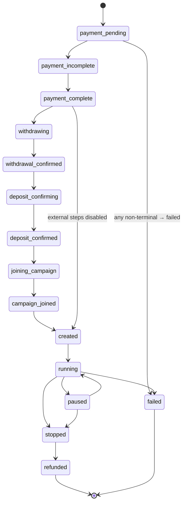

### Intent state (Trading layer / StrategyOrderIntent)

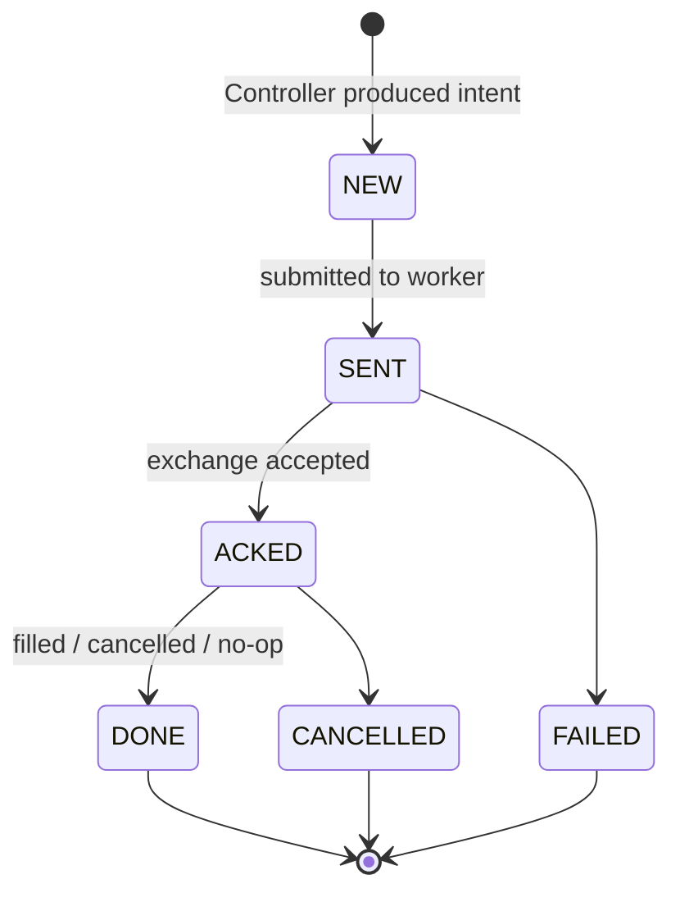

### Reservation lifecycle (Funding layer rule)

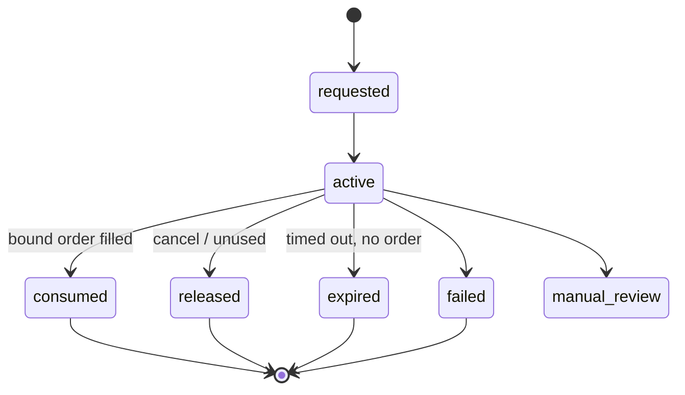

### Withdrawal state

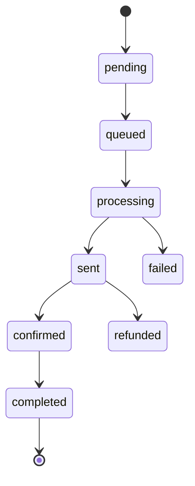

---

## 5. Reward Distribution — Two-Layer Model (Whitepaper §, Yellowpaper §5)

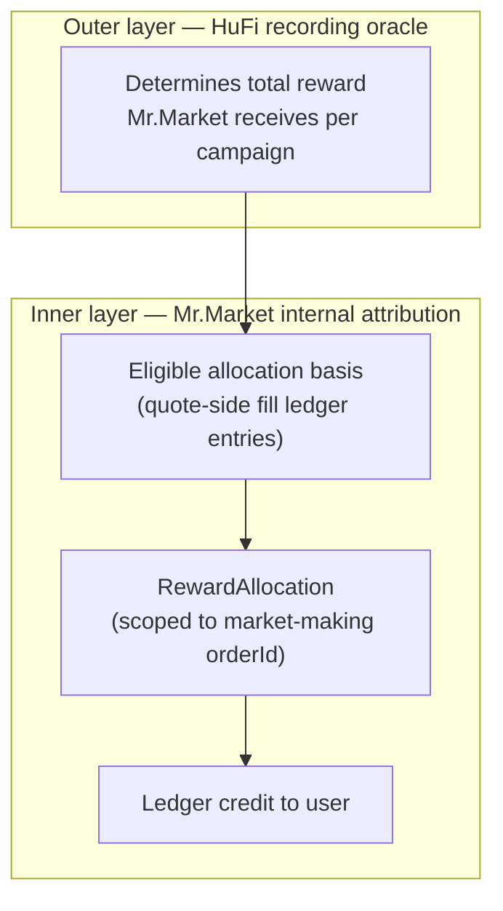

### Reward settlement state

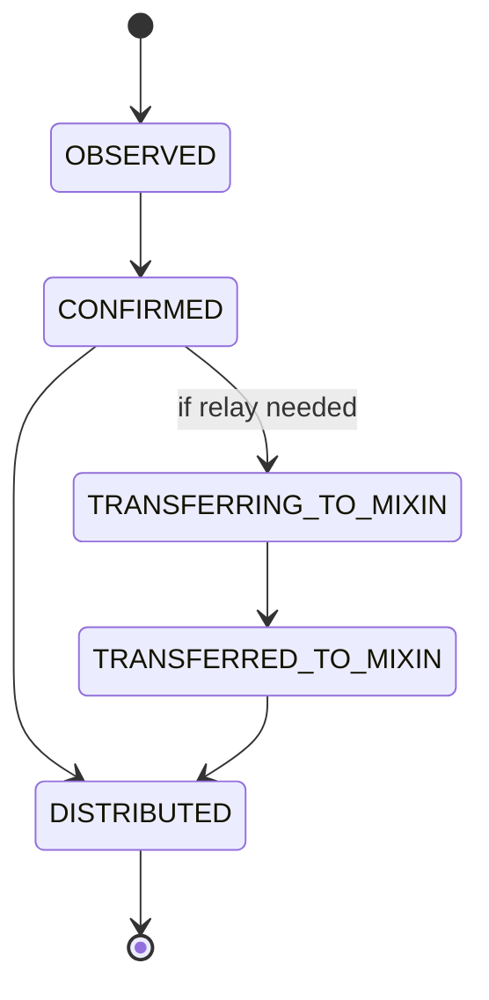

---

## 6. Ledger + Durability Coupling (Business Flow 4)

Every balance change is an immutable, idempotent, transactional ledger entry.

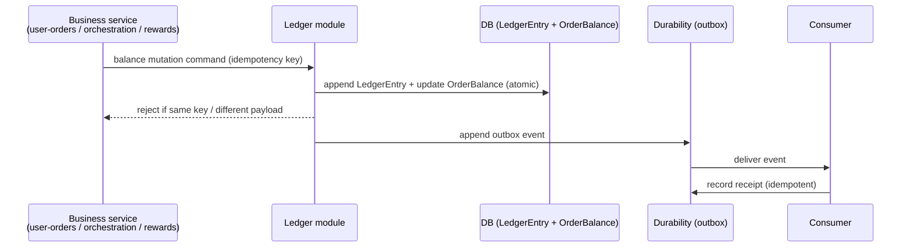
