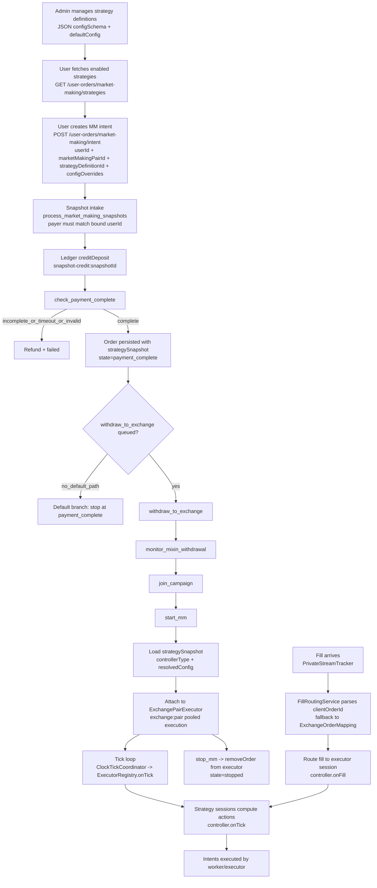

# Market Making Flow

This document describes the current backend market making flow.

It is based on the current implementation in `server/src/modules/market-making/**`.

## Architecture Summary

The runtime is tick-driven, intent-driven, and uses pooled executors.

1. Trackers update local exchange state on each tick.
2. Pooled executors share market data per `exchange:pair`.
3. Strategy builds intents from current state using pinned config snapshot.
4. Controllers emit executor actions and orchestrator writes intents.
5. Intent executor sends exchange actions with idempotency and retries.
6. Ledger is the only balance mutation entrypoint.

Key architectural decisions:

- **Pinned Snapshot**: Orders store `strategySnapshot` at creation time; runtime never re-resolves config.
- **Pooled Executors**: `ExecutorRegistry` manages `ExchangePairExecutor` per `exchange:pair` for shared market data.
- **Fill Routing**: Fills are routed via `clientOrderId` parsing with `ExchangeOrderMapping` fallback.

## Core Modules

### Strategy and Execution

- `server/src/modules/market-making/strategy/strategy.service.ts` - Strategy runtime entry point
- `server/src/modules/market-making/strategy/execution/executor-registry.ts` - Pooled executor lifecycle
- `server/src/modules/market-making/strategy/execution/exchange-pair-executor.ts` - Shared market-data/tick boundary
- `server/src/modules/market-making/strategy/execution/strategy-runtime-dispatcher.service.ts` - Controller dispatch
- `server/src/modules/market-making/strategy/execution/strategy-intent-execution.service.ts` - Intent execution
- `server/src/modules/market-making/strategy/dex/strategy-config-resolver.service.ts` - Config resolution

### Fill Routing

- `server/src/modules/market-making/execution/fill-routing.service.ts` - Fill routing with fallback chain
- `server/src/modules/market-making/execution/exchange-order-mapping.service.ts` - Mapping persistence
- `server/src/common/helpers/client-order-id.ts` - clientOrderId format helpers

### Infrastructure

- `server/src/modules/market-making/tick/clock-tick-coordinator.service.ts` - Tick coordination
- `server/src/modules/market-making/ledger/balance-ledger.service.ts` - Balance mutations
- `server/src/modules/market-making/user-orders/market-making.processor.ts` - MM queue processor

## Flow Diagram



### Main Elements

- **Strategy catalog**: Admin-defined strategy definitions with JSON config schema and defaults.
- **Config overrides**: User can provide `configOverrides` at intent creation time, but server rejects system-managed fields and schema-invalid overrides immediately.
- **Snapshot pinning**: Orders store resolved config at creation; runtime reads only from snapshot.
- **Pooled executors**: `ExecutorRegistry` manages `ExchangePairExecutor` per `exchange:pair`.
- **Fill routing**: `clientOrderId` format `{orderId}:{seq}` with `ExchangeOrderMapping` fallback.
- **Ledger safety**: All balance mutations go through `BalanceLedgerService`.

## End-to-End Flow

### 0) User creates a market-making intent

1. User fetches enabled strategies from `GET /user-orders/market-making/strategies`.
2. User creates intent via `POST /user-orders/market-making/intent` with:
   - `userId` (required, becomes the bound owner/payer for the intent)
   - `marketMakingPairId`
   - `strategyDefinitionId` (required, must exist and be enabled)
   - `configOverrides` (optional, merged with definition defaults after early validation)
3. Intent row is persisted in `market_making_order_intent` with bound `userId`, `strategyDefinitionId`, and `configOverrides`.

### 1) Snapshot intake and payment state tracking

1. Snapshot polling routes market making create snapshots to `process_market_making_snapshots`.
2. Snapshot intake verifies the incoming payer matches the intent-bound `userId`; mismatches are refunded.
3. `handleProcessMMSnapshot` validates pair and fee requirements.
4. Payment state is created or updated and later payments must match the same `userId`.
5. Snapshot intake is credited to ledger (`creditDeposit`) with idempotency key `snapshot-credit:{snapshotId}`.
6. `check_payment_complete` is queued.

### 2) Payment completion and order creation

1. `handleCheckPaymentComplete` verifies base, quote, and required fee coverage.
2. If payment is incomplete and timeout/retries are exceeded, order is failed and refunded.
3. If complete:
   - Intent state is updated
   - `StrategyConfigResolverService.resolveForOrderSnapshot()` resolves config:
     - Load `StrategyDefinition`
     - Merge `defaultConfig` + `configOverrides`
     - Validate against `configSchema`
   - Market making order is created with `strategySnapshot`:
     ```typescript
     strategySnapshot: {
       controllerType: string;
       resolvedConfig: Record<string, unknown>;
     }
     ```
   - Order state becomes `payment_complete`

Current behavior:

- Queueing `withdraw_to_exchange` is still disabled in this flow.
- This path logs and stops at `payment_complete` unless other jobs/flows continue the lifecycle.

### 3) Withdrawal and campaign stage (when used)

If withdrawal path is enabled and used:

1. `withdraw_to_exchange` resolves network/deposit addresses.
2. Current code is validation mode and refunds instead of submitting real withdrawal.
3. `monitor_mixin_withdrawal` checks confirmation status and can queue `join_campaign`.
4. `join_campaign` creates local campaign participation and queues `start_mm`.
   It does not perform direct HuFi Web3 `/campaigns/join` in this runtime path.

### 4) Start market making (pooled executor)

`start_mm`:

- Sets order state to `running`.
- Loads order's `strategySnapshot` (required, throws if missing).
- Extracts `controllerType` and `resolvedConfig` from snapshot.
- Converts `controllerType` to `StrategyType` via dispatcher.
- Calls `StrategyRuntimeDispatcher.startByStrategyType()`:
  - Gets or creates `ExchangePairExecutor(exchange, pair)` from `ExecutorRegistry`.
  - Adds order session to executor with resolved config.
- Does NOT query `StrategyDefinition` at runtime (snapshot is source of truth).

### 5) Tick-driven pooled execution

1. `ClockTickCoordinatorService` calls `onTick` for registered components.
2. `StrategyService.onTick` iterates `ExecutorRegistry.getActiveExecutors()`.
3. For each `ExchangePairExecutor`:
   - Checks `session.nextRunAtMs` against current time.
   - Calls `executor.onTick(ts)` which triggers `handlers.onTick(session, ts)`.
4. Handler invokes controller `decideActions(session, marketData)`.
5. Controller emits actions (place/cancel/stop).
6. Orchestrator writes intents to `StrategyOrderIntentEntity`.
7. Intent worker/executor processes pending intents asynchronously.

### 6) Fill routing flow

1. `PrivateStreamTracker` receives fill event with `clientOrderId`.
2. `FillRoutingService.resolveOrderForFill()` routes the fill:
   - **Primary path**: Parse `clientOrderId` format `{orderId}:{seq}`.
   - **Fallback 1**: Look up `ExchangeOrderMapping` by `clientOrderId`.
   - **Fallback 2**: Look up `ExchangeOrderMapping` by `exchangeOrderId`.
   - **Orphan**: Log for manual review if all fail.
3. `ExecutorRegistry.findExecutorByOrderId()` resolves executor for order.
4. `ExchangePairExecutor.onFill(fill)` dispatches to session handler.
5. Controller `onFill(session, fill)` processes and may emit new actions.

### 7) Stop market making

`stop_mm`:

- Calls `executorRegistry.findExecutorByOrderId(orderId)`.
- Calls `executor.removeOrder(orderId)`.
- Calls `executorRegistry.removeExecutorIfEmpty(exchange, pair)`.
- Sets order state to `stopped`.

## clientOrderId Format

Format: `{orderId}:{seq}`

```typescript
// Build
function buildClientOrderId(orderId: string, seq: number): string {
  return `${orderId}:${seq}`;
}

// Parse
function parseClientOrderId(
  clientOrderId: string
): { orderId: string; seq: number } | null {
  const parts = clientOrderId.split(":");
  if (parts.length !== 2) return null;
  const seq = parseInt(parts[1], 10);
  if (isNaN(seq)) return null;
  return { orderId: parts[0], seq };
}
```

The real implementation in `server/src/common/helpers/client-order-id.ts` adds stricter runtime checks: `parts[0]` must be non-empty, `parts[1]` must match `/^\d+$/`, `seq` is parsed with `parseInt`, and invalid or unsafe values return `null`.

Prerequisites:

- `orderId` uses UUID format (no `:` character).
- `seq` is a non-negative integer.

## Pooled Executor Architecture

### ExecutorRegistry

Manages `ExchangePairExecutor` lifecycle:

```typescript
class ExecutorRegistry {
  getOrCreateExecutor(exchange: string, pair: string): ExchangePairExecutor;
  removeExecutorIfEmpty(exchange: string, pair: string): void;
  getExecutor(exchange: string, pair: string): ExchangePairExecutor | undefined;
  getActiveExecutors(): ExchangePairExecutor[];
  findExecutorByOrderId(orderId: string): ExchangePairExecutor | undefined;
}
```

Lifecycle:

- Created on-demand when first order is added.
- Removed automatically when no orders remain.

### ExchangePairExecutor

Shared execution boundary per `exchange:pair`:

```typescript
class ExchangePairExecutor {
  readonly exchange: string;
  readonly pair: string;

  addOrder(
    orderId: string,
    userId: string,
    config: OrderConfig
  ): Promise<Session>;
  removeOrder(orderId: string): Promise<void>;
  onTick(ts: string): Promise<void>;
  onFill(fill: Fill): Promise<void>;
  isEmpty(): boolean;
}
```

Benefits:

- Orders on same `exchange:pair` share market data.
- Execution scheduling is pooled, reducing per-order overhead.
- Future extension point for `exchange:apiKeyId:pair` multi-account support.

## Queue Jobs Registered

Queue: `market-making`

- `process_market_making_snapshots`
- `check_payment_complete`
- `withdraw_to_exchange`
- `monitor_mixin_withdrawal`
- `join_campaign`
- `start_mm`
- `stop_mm`

Removed from runtime flow:

- `execute_mm_cycle` (replaced by tick-driven pooled execution)

## Balance and Ledger Rules

All balance mutations must go through `BalanceLedgerService`.

Common mutations in MM flow:

- Snapshot intake: `creditDeposit`
- Refund path: `debitWithdrawal` before transfer
- Refund transfer failure: compensation `creditDeposit`
- Pause/withdraw orchestration: `unlockFunds` then `debitWithdrawal`

Concurrency protection:

- Ledger serializes same `userId:assetId` mutation path in-process.

## State Progression

Common order states in current flow:

`payment_pending -> payment_complete -> campaign_joined -> running -> stopped`

Failure paths can move to:

`failed`

## Strategy Definition and Snapshot

### Definition Structure

```typescript
interface StrategyDefinition {
  id: string;
  key: string;
  name: string;
  controllerType:
    | "pureMarketMaking"
    | "signalAwareMarketMaking"
    | "arbitrage"
    | "volume";
  configSchema: Record<string, unknown>; // JSON schema
  defaultConfig: Record<string, unknown>;
  enabled: boolean;
  visibility: "system" | "instance";
}
```

### Snapshot Resolution Flow

```typescript
async resolveForOrderSnapshot(definitionId: string, overrides?: Record<string, unknown>) {
  // 1. Load definition
  const definition = await this.findOne({ where: { id: definitionId } });

  // 2. Merge defaults + overrides
  const resolvedConfig = deepMerge(definition.defaultConfig, overrides || {});

  // 3. Validate against schema
  this.validateConfigAgainstSchema(resolvedConfig, definition.configSchema);

  // 4. Return snapshot payload
  return {
    controllerType: definition.controllerType,
    resolvedConfig,
  };
}
```

### Snapshot Requirement

The current prototype only supports orders created after the snapshot cutover.
If an order does not have `strategySnapshot`, recreate it through the current
payment flow instead of backfilling legacy rows.

## Operational Notes

- `strategy.execute_intents=false` means intents are created and marked processed but no live exchange actions are sent.
- `strategy.intent_execution_driver=worker` decouples tick from exchange execution and keeps tick latency stable under load.
- `strategy.intent_execution_driver=sync` keeps legacy inline execution behavior.
- Strategy definitions are DB-backed and managed via admin APIs.
- Orders require `strategySnapshot` before `start_mm` can run.
- `withdraw_to_exchange` path is currently validation/refund mode.
- Volume routing uses execution categories (`clob_cex`, `amm_dex`); `clob_dex`
  remains reserved and is rejected during config resolution.
- Reconciliation and trackers should be monitored for state drift.

## File Structure

```text
server/src/modules/market-making/
├── strategy/
│   ├── strategy.service.ts
│   ├── strategy.module.ts
│   ├── config/
│   │   ├── strategy-controller.registry.ts
│   │   ├── strategy-controller.types.ts
│   │   └── strategy-controller-aliases.ts
│   ├── controllers/
│   │   ├── pure-market-making-strategy.controller.ts
│   │   ├── arbitrage-strategy.controller.ts
│   │   └── volume-strategy.controller.ts
│   ├── execution/
│   │   ├── executor-registry.ts
│   │   ├── exchange-pair-executor.ts
│   │   ├── strategy-runtime-dispatcher.service.ts
│   │   ├── strategy-intent-execution.service.ts
│   │   ├── strategy-intent-worker.service.ts
│   │   └── strategy-intent-store.service.ts
│   └── dex/
│       └── strategy-config-resolver.service.ts
├── execution/
│   ├── exchange-connector-adapter.service.ts
│   ├── fill-routing.service.ts
│   └── exchange-order-mapping.service.ts
├── tick/
│   └── clock-tick-coordinator.service.ts
├── trackers/
│   ├── order-book-tracker.service.ts
│   ├── private-stream-tracker.service.ts
│   └── exchange-order-tracker.service.ts
├── user-orders/
│   ├── user-orders.controller.ts
│   ├── user-orders.service.ts
│   └── market-making.processor.ts
├── ledger/
│   └── balance-ledger.service.ts
└── durability/
    └── durability.service.ts
```

## Last Updated

- Date: 2026-03-11
- Status: Active
- Architecture: Pooled Executor v3.0
