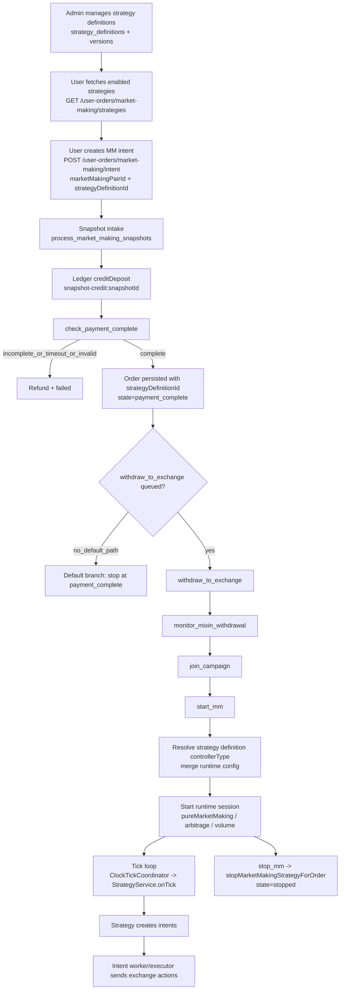

# Market Making Flow

This document describes the current backend market making flow.

It is based on the current implementation in `server/src/modules/market-making/**`.

## Architecture Summary

The runtime is now tick-driven and intent-driven.

1. Trackers update local exchange state on each tick.
2. Strategy builds intents from current state.
3. Intent executor sends exchange actions with idempotency and retries.
4. Ledger is the only balance mutation entrypoint.

The old queue self-loop `execute_mm_cycle` has been removed.
`start_mm` now resolves the bound strategy definition for the order, starts the matching strategy runtime, and periodic execution comes from tick scheduling.

## Core Modules

- Tick coordinator: `server/src/modules/market-making/tick/clock-tick-coordinator.service.ts`
- Strategy runtime: `server/src/modules/market-making/strategy/strategy.service.ts`
- Intent execution: `server/src/modules/market-making/strategy/strategy-intent-execution.service.ts`
- Ledger: `server/src/modules/market-making/ledger/balance-ledger.service.ts`
- Main MM queue processor: `server/src/modules/market-making/user-orders/market-making.processor.ts`
- Strategy definition admin runtime: `server/src/modules/admin/strategy/adminStrategy.service.ts`

## Flow Diagram

### Main Elements

- Strategy catalog: admin-defined strategy definitions and versions.
- User intent: market making order intent must carry `strategyDefinitionId`.
- Funds and payment state: snapshot intake, ledger crediting, and payment completion checks.
- Queue orchestration: `process_market_making_snapshots`, `check_payment_complete`, optional withdrawal/campaign jobs, `start_mm`, `stop_mm`.
- Runtime execution: `start_mm` resolves strategy type dynamically and registers sessions.
- Tick and intents: tick loop drives strategy sessions, intents are executed by worker/executor path.
- Ledger safety: all balance mutations go through `BalanceLedgerService`.

## End-to-End Flow

### 0) User creates a market making intent

1. User fetches enabled strategies from `GET /user-orders/market-making/strategies`.
2. User creates intent via `POST /user-orders/market-making/intent` with:
   - `marketMakingPairId`
   - `strategyDefinitionId` (required, must exist and be enabled)
3. Intent row is persisted in `market_making_order_intent` with `strategyDefinitionId`.

### 1) Snapshot intake and payment state tracking

1. Snapshot polling routes market making create snapshots to `process_market_making_snapshots`.
2. `handleProcessMMSnapshot` validates pair and fee requirements.
3. Payment state is created or updated.
4. Snapshot intake is credited to ledger (`creditDeposit`) with idempotency key `snapshot-credit:{snapshotId}`.
5. `check_payment_complete` is queued.

## 2) Payment completion checks

1. `handleCheckPaymentComplete` verifies base, quote, and required fee coverage.
2. If payment is incomplete and timeout/retries are exceeded, order is failed and refunded.
3. If complete:
   - intent state is updated
   - market making order is created/updated with `strategyDefinitionId`
   - order state becomes `payment_complete`

Current behavior:
- Queueing `withdraw_to_exchange` is still disabled in this flow.
- This path logs and stops at `payment_complete` unless other jobs/flows continue the lifecycle.

### 3) Withdrawal and campaign stage (when used)

If withdrawal path is enabled and used:

1. `withdraw_to_exchange` resolves network/deposit addresses.
2. Current code is validation mode and refunds instead of submitting real withdrawal.
3. `monitor_mixin_withdrawal` checks confirmation status and can queue `join_campaign`.
4. `join_campaign` creates local campaign participation and queues `start_mm`.
   It does not perform direct HuFi Web3 `/campaigns/join` in this runtime path.

### 4) Start and stop market making

`start_mm`:
- Sets order state to `running`.
- Loads bound `strategyDefinitionId` and resolves `controllerType`.
- Merges definition defaults with order runtime config.
- Dynamically dispatches by strategy type:
  - `pureMarketMaking` -> `executePureMarketMakingStrategy(...)`
  - `arbitrage` -> `startArbitrageStrategyForUser(...)`
  - `volume` -> `executeVolumeStrategy(...)`
- Links started strategy instance to definition metadata.
- Does not enqueue `execute_mm_cycle`.

`stop_mm`:
- Calls `strategyService.stopMarketMakingStrategyForOrder(orderId)`.
- Sets order state to `stopped`.

### 4.1) Dynamic strategy definition path

Dynamic strategy definitions are used by both admin runtime and user MM order flow:

1. Definitions are stored in `strategy_definitions` with config schema/defaults.
2. Published snapshots are tracked in `strategy_definition_versions`.
3. User MM intent creation requires `strategyDefinitionId` and validates enabled definition.
4. Admin start flow validates merged config against definition schema.
5. Instance start links runtime row to definition using:
   - `strategy_instances.definitionId`
   - `strategy_instances.definitionVersion`
6. Legacy instances can be backfilled through admin API:
   - `POST /admin/strategy/instances/backfill-definition-links`

### 5) Tick-driven strategy execution

1. `ClockTickCoordinatorService` calls `onTick` for registered components in order.
2. `StrategyService.onTick` runs active sessions by cadence.
3. For each session, strategy creates intents (create/cancel/stop) and persists them.
4. Tick does not synchronously execute intents when `strategy.intent_execution_driver=worker`.
5. `StrategyIntentWorkerService` polls pending intents and dispatches async execution.
6. Worker enforces safety gates: max global in-flight, max per-exchange in-flight, and one in-flight per strategy key.
7. `StrategyIntentExecutionService` executes exchange actions, updates trackers, and records durability status.

## Queue Jobs Registered

Queue: `market-making`

- `process_market_making_snapshots`
- `check_payment_complete`
- `withdraw_to_exchange`
- `monitor_mixin_withdrawal`
- `join_campaign`
- `start_mm`
- `stop_mm`

Current default lifecycle branch:
- `check_payment_complete` does not enqueue `withdraw_to_exchange` (disabled in current implementation),
  so withdrawal/campaign jobs are registered but typically not reached unless queued by another flow.

Removed from runtime flow:

- `execute_mm_cycle`

## Balance and Ledger Rules

All balance mutations must go through `BalanceLedgerService`.

Common mutations in MM flow:
- Snapshot intake: `creditDeposit`
- Refund path: `debitWithdrawal` before transfer
- Refund transfer failure: compensation `creditDeposit`
- Pause/withdraw orchestration: `unlockFunds` then `debitWithdrawal`

Concurrency protection:
- Ledger now serializes same `userId:assetId` mutation path in-process.

## State Progression

Common order states in current flow:

`payment_pending -> payment_complete -> campaign_joined -> running -> stopped`

Failure paths can move to:

`failed`

Exact transitions depend on which queue branches are enabled in your environment.
With current default branch (`withdraw_to_exchange` queueing disabled), many orders stop at `payment_complete`.

## Operational Notes

- `strategy.execute_intents=false` means intents are created and marked processed but no live exchange actions are sent.
- `strategy.intent_execution_driver=worker` decouples tick from exchange execution and keeps tick latency stable under load.
  Tick only creates/persists intents, and a separate worker executes exchange API actions with its own concurrency and retry controls.
- `strategy.intent_execution_driver=sync` keeps legacy inline execution behavior and can increase tick latency.
  Tick both generates and executes intents in the same path, so slow exchange calls directly extend tick duration.
- Strategy definitions are now DB-backed and can be managed in admin settings (`/manage/settings/strategies`).
- For migration/cutover details, follow `docs/plans/2026-02-28-dynamic-strategy-architecture-transition-plan.md`.
- `withdraw_to_exchange` path is currently validation/refund mode in this implementation.
- Tick coordinator is now the periodic execution source for active strategy sessions.
- Reconciliation and trackers should be monitored to detect drift between local state and exchange state.

## Last Updated

- Date: 2026-03-02
- Status: Active
